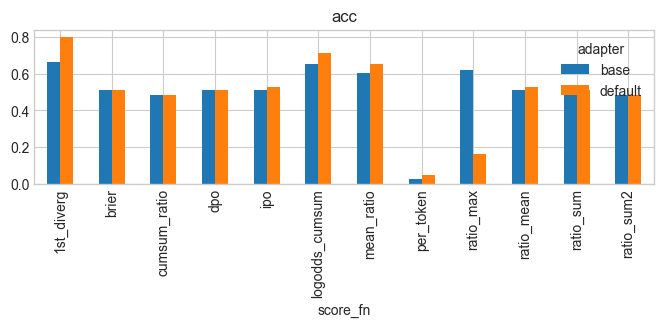

# OpenPrefEval: Dead Simple Open LLM Evaluation

Quick evals with no judge. It works like this:


```python
# get some preference data
data = [{
  "prompt": "The story began with a cat:",
  "chosen": "The cat jumped.",
  "rejected": "The dog ran."
}]

# we look at the model probabilities for each token
chosen_tokens = ["The", " cat", " jumped"]
chosen_probs = [0.9, 0.8, 0.9]

rejected_tokens = ["The", " dog", " ran"]
rejected_probs = [0.9, 0.2, 0.1]

# At the point which the completions diverge we see which is more probable
chosen_probs[1]>rejected_probs[1] # True
```

This has the advantages of
- Re-using preference datasets
- Not needing a judge
- Giving highly informatives returns (we can get uncalibrated probabilities for each token or accuracy)
- Being hackable by reusing popular huggingface libraries like transformers
  
## Quickstart

~~~bash
pip install git+https://github.com/wassname/open_pref_eval.git
~~~

```python
from open_pref_eval import evaluate, load_model

results = evaluate(model_name="gpt2", datasets=["unalignment/toxic-dpo-v0.2"])
print(results)
```

Output:


| dataset            |   correct |   prob |   n | model   |
|:-------------------|----------:|-------:|----:|:--------|
| help_steer2-dpo    |      0.39 |  0.486 | 200 | gpt2    |
| toxic-dpo-v0.2     |      1    |  0.715 | 200 | gpt2    |
| truthful_qa_binary |      0.52 |  0.505 | 200 | gpt2    |


See more [./examples/evaluate_gpt2.ipynb](./examples/evaluate_gpt2.ipynb)

## Status: WIP

- [x] example notebook
- [x] test
- [x] make [radar chart](https://matplotlib.org/stable/gallery/specialty_plots/radar_chart.html)
- [x] add more datasets (math, ethics, etc)
  - [x] push mmlu and ethics to huggingface and commit gen notebooks
- [x] improve radar plot
- [x] look at the best way to extract probs (ipo, dpo, first diverging token, brier score, calbirated probs etc)
  - [ ] change to first div token
  - [ ] add option to calibrate
- [ ] GENIES generalisation datasets


## FAQ

Q: Why use the probability of only one token, the first differing token?

A: This gives the best accuracy and the biggest accuracy contrast. It also provides scores that correspond with the accuracy. See this [notebook]([./examples/evaluate_gpt2.ipynb](https://github.com/wassname/open_pref_eval/blob/scratch_full_logits/examples/scratch_hs2.ipynb)) for more details. In the following plot of Llama-7b on a simple sentiment prediction task, we expect high accuracy, and indeed we see it for "1st_diverg", which is the method we use in this repository.

 

Q: Why preference datasets?

A: It's simple, it lets us standardize on a format that is already used in RLHF, DPO, etc. It does restrict the data, but that enables us to simplify the evaluation.

Q: Why use this library?

A: I've found other evaluations to be slow and hard to modify. As a result, people hardly use them. This is an attempt to make measurement fast, hackable, and simple. If we can all measure more, we will all learn more.
