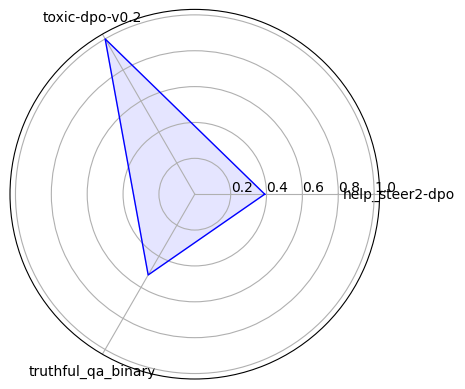

# OpenPrefEval: Dead Simple Open LLM Evaluation

Quick evals with no judge. It works like this:


```py
# get some preference data
data = [{
  "prompt": "The story began with a cat:",
  "chosen": "The cat jumped.",
  "rejected": "The dog ran."
}]

# we look at the mean model probabilities for tokens similar to [Implicit Preference Optimization (IPO)](https://arxiv.org/abs/2502.16182)
chosen_tokens = ["The", " cat", " jumped"]
chosen_probs = mean([0.9, 0.8, 0.9])

rejected_tokens = ["The", " dog", " ran"]
rejected_probs = mean([0.9, 0.2, 0.1])

# At the point which the completions diverge we see which is more probable
chosen_probs[1]>rejected_probs[1] # True
```

This has the advantages of
- Re-using preference datasets
- Not needing a judge
- Giving highly informative returns (we can get uncalibrated probabilities for each token or accuracy)
- Being hackable by reusing popular huggingface libraries like transformers
  
## Quickstart

~~~bash
pip install git+https://github.com/wassname/open_pref_eval.git
~~~

```python
from open_pref_eval import evaluate, load_model

results = evaluate(model_name="gpt2", datasets=["unalignment/toxic-dpo-v0.2"])
print(results)
```

Output:

TOTO add minutes

| dataset            |   acc     |   prob |   n | model   |
|:-------------------|----------:|-------:|----:|:--------|
| help_steer2-dpo    |      0.39 |  0.486 | 200 | gpt2    |
| toxic-dpo-v0.2     |      1    |  0.715 | 200 | gpt2    |
| truthful_qa_binary |      0.52 |  0.505 | 200 | gpt2    |




See more [./examples/evaluate_gpt2.ipynb](./examples/evaluate_gpt2.ipynb)

## Status: WIP

- [x] example notebook
- [x] test
- [x] make [radar chart](https://matplotlib.org/stable/gallery/specialty_plots/radar_chart.html)
- [x] add more datasets (math, ethics, etc)
  - [x] push mmlu and ethics to huggingface and commit gen notebooks
- [x] improve radar plot
- [x] look at the best way to extract probs (ipo, dpo, first diverging token, brier score, calbirated probs etc)
  - [x] filter out attention mask
  - [ ] filter out attention sinks? special tokens? 
  - [ ] ~~add option to calibrate~~ doesn't work
- [x] GENIES generalisation datasets
TODO
- [x] try WPO https://arxiv.org/html/2406.11827v2
- [x] adapt to new TRL
- [x] abandon TRL and just make a very simple, like the 
  - https://github.com/Eclectic-Sheep/sheeprlhf/blob/efa765089c3cce1e40c5f9a39fa7d43e002738b6/sheeprlhf/loss/dpo.py#L21
  - https://github.com/eric-mitchell/direct-preference-optimization

## FAQ


Q: Why preference datasets?

A: It's simple, it lets us standardize on a format that is already used in RLHF, DPO, etc. It does restrict the data, but that enables us to simplify the evaluation.

Q: Why use this library?

A: I've found other evaluations to be slow and hard to modify. As a result, people hardly use them. This is an attempt to make measurement fast, hackable, and simple. If we can all measure more, we will all learn more.

